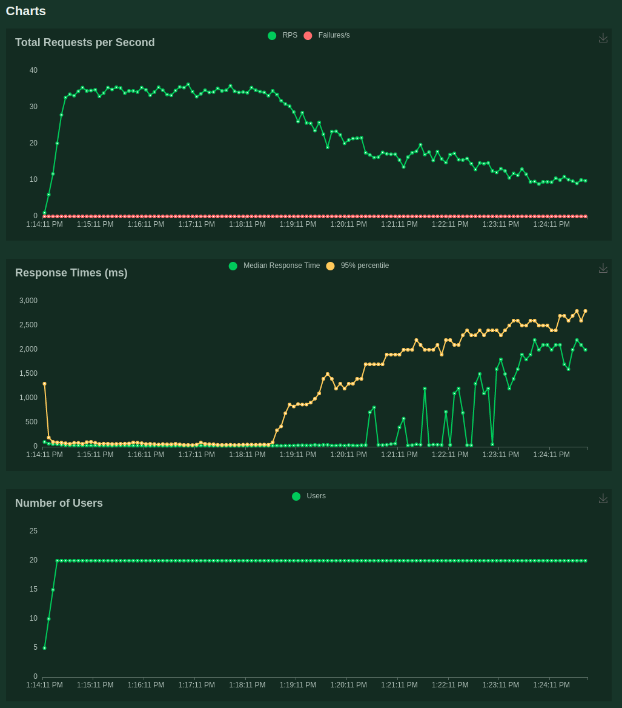

# Trino issue: allocation stalls with ZGC

**Trino version**: 392

## Description

We have been using the default G1GC garbage collector for our trino clusters in our production environment. However, as the usage of our clusters increased in both concurrency and processed data,
we started to experience higher number of coordinator crashes due to memory issues.

In finding a solution for this problem, we decided to switch to ZGC, which promised better performance in higher-concurrency use cases. Initially, ZGC proved to be more stable in cases of usage spikes (frequent case in our deployments). However, soon we observed that after a longer usage under mild (but constant) concurrency load, the cluster performance decreased dramatically, up to the point, where we had to do periodic restarts in order to maintain our performance SLAs.

Upon checking the node logs, we found that when using ZGC, periods of **allocation stalls** are created, causing the performance degradation of our Trino clusters. The following is an example log generated by ZGC:

```
trino_test_trino-coordinator.1.76bikgr3bu48@jp    | [1282.654s][info][gc] Allocation Stall (Query-20220812_072359_15696_jcf6c-481) 315.305ms
trino_test_trino-coordinator.1.76bikgr3bu48@jp    | [1282.654s][info][gc] Allocation Stall (dispatch-executor-1) 288.598ms
trino_test_trino-coordinator.1.76bikgr3bu48@jp    | [1282.654s][info][gc] Allocation Stall (Query-20220812_072359_15693_jcf6c-495) 608.775ms
trino_test_trino-coordinator.1.76bikgr3bu48@jp    | [1282.654s][info][gc] Allocation Stall (task-management-0) 763.730ms
trino_test_trino-coordinator.1.76bikgr3bu48@jp    | [1282.654s][info][gc] Allocation Stall (http-worker-347) 508.772ms
trino_test_trino-coordinator.1.76bikgr3bu48@jp    | [1282.654s][info][gc] Allocation Stall (dispatcher-query-28) 610.574ms
trino_test_trino-coordinator.1.76bikgr3bu48@jp    | [1282.654s][info][gc] Allocation Stall (execution-query-purger) 741.826ms
trino_test_trino-coordinator.1.76bikgr3bu48@jp    | [1282.654s][info][gc] Allocation Stall (Query-20220812_072359_15691_jcf6c-657) 917.566ms
trino_test_trino-coordinator.1.76bikgr3bu48@jp    | [1282.654s][info][gc] Allocation Stall (Query-20220812_072359_15694_jcf6c-670) 505.529ms
trino_test_trino-coordinator.1.76bikgr3bu48@jp    | [1282.655s][info][gc] Allocation Stall (http-worker-412) 609.176ms
trino_test_trino-coordinator.1.76bikgr3bu48@jp    | [1282.655s][info][gc] Allocation Stall (task-management-3) 417.047ms
trino_test_trino-coordinator.1.76bikgr3bu48@jp    | [1282.655s][info][gc] Allocation Stall (Query-20220812_072359_15695_jcf6c-548) 500.958ms
trino_test_trino-coordinator.1.76bikgr3bu48@jp    | [1282.656s][info][gc] Allocation Stall (http-worker-149) 382.338ms
trino_test_trino-coordinator.1.76bikgr3bu48@jp    | [1282.656s][info][gc] Allocation Stall (http-worker-324) 382.046ms
trino_test_trino-coordinator.1.76bikgr3bu48@jp    | [1282.655s][info][gc] Allocation Stall (http-worker-579) 808.813ms
trino_test_trino-coordinator.1.76bikgr3bu48@jp    | [1282.656s][info][gc] Allocation Stall (query-management-0) 321.597ms
trino_test_trino-coordinator.1.76bikgr3bu48@jp    | [1282.655s][info][gc] Allocation Stall (http-worker-782) 859.915ms
trino_test_trino-coordinator.1.76bikgr3bu48@jp    | [1282.655s][info][gc] Allocation Stall (drain-state-query-manager) 765.133ms
trino_test_trino-coordinator.1.76bikgr3bu48@jp    | [1282.654s][info][gc] Allocation Stall (Query-20220812_072359_15692_jcf6c-676) 701.954ms
trino_test_trino-coordinator.1.76bikgr3bu48@jp    | [1282.656s][info][gc] Allocation Stall (query-management-1) 321.554ms
trino_test_trino-coordinator.1.76bikgr3bu48@jp    | [1282.655s][info][gc] Allocation Stall (Announcer-3) 703.846ms
trino_test_trino-coordinator.1.76bikgr3bu48@jp    | [1282.685s][info][gc] GC(384) Garbage Collection (Allocation Stall) 2612M(85%)->2292M(75%)
```

## Issue reproduction

For reproducing the issue, we provide:

- an example Trino Docker swarm deployment
- an example `locustfile`, that will send simple query requests (we use TPC-DS SF1 for local testing) to the example local Trino deployment

To reproduce the issue, first deploy the example Docker swarm deployment by running the following command:

```
source deploy.sh
```

Next, initiate the Locust load test by running the following command:

```
locust
```

In the Locust UI, set the number of users to 20 and the spawn rate to 1.

A similar behavior of gradual performance decrease should occur within few minutes of load testing.

In our example deployment, we use the following JVM configuration:

```
-server
-verbose:gc
-Xlog:gc
-Xmx3G
-XX:+UseZGC
-XX:InitialRAMPercentage=80
-XX:MaxRAMPercentage=80
-XX:G1HeapRegionSize=32M
-XX:+ExplicitGCInvokesConcurrent
-XX:+ExitOnOutOfMemoryError
-XX:+HeapDumpOnOutOfMemoryError
-XX:-OmitStackTraceInFastThrow
-XX:ReservedCodeCacheSize=512M
-XX:PerMethodRecompilationCutoff=10000
-XX:PerBytecodeRecompilationCutoff=10000
-Djdk.attach.allowAttachSelf=true
-Djdk.nio.maxCachedBufferSize=2000000
-XX:+UnlockDiagnosticVMOptions
-XX:+UseAESCTRIntrinsics
```

This configuration is the default Trino configuration with the exception of the choice of the garbage collector, where we use ZGC.

The following are the output plots from Locust, showing the performance degradation via gradual decrease in query throughput and increase in query latency:



In the load test, that produced these results, we used 20 concurrent workers and a spawn rate of 1.